# 🧠 Caderno de Erros & Estratégia Tática de Prova EEAR
### A Metodologia Definitiva para Eliminar Pontos Cegos e Dominar o Tempo de Prova

> *"O concurseiro amador faz questões para acertar. O militar aprovado faz questões para descobrir onde erra e nunca mais cometer o mesmo equívoco."*

---

## ⏱️ 1. Gestão Tática dos 260 Minutos (4h20min) da EEAR

A prova da EEAR possui **96 questões**. Isso equivale a **~2,7 minutos por questão**.  
Tentar resolver as 96 questões na ordem linear (de 1 a 96) é a principal armadilha que reprova candidatos bem preparados.

### Cronograma de Batalha Sugerido:

```mermaid
gantt
    title Distribuição Estratégica dos 260 Minutos da Prova EEAR
    dateFormat  m
    axisFormat %H:%M
    
    Português (24 quest.) :active, p1, 0, 40
    Inglês (24 quest.)    :active, p2, 40, 80
    Física (24 quest.)    :active, p3, 80, 140
    Matemática (24 quest.):active, p4, 140, 220
    2ª Passada (Dúvidas)  :crit, p5, 220, 240
    Gabarito Oficial      :done, p6, 240, 260
```

| Bloco de Tempo | Disciplina / Etapa | Minutos | Meta de Ritmo |
| :---: | :--- | :---: | :--- |
| **00:00 às 00:40** | **Língua Portuguesa** (24 questões) | 40 min | ~1,6 min/questão. Resolva primeiro as de gramática pura e pontuação; depois leia os textos. |
| **00:40 às 01:20** | **Língua Inglesa** (24 questões) | 40 min | ~1,6 min/questão. Faça primeiro gramática/phrasal verbs/modals; depois faça as de compreensão textual. |
| **01:20 às 02:20** | **Física** (24 questões) | 60 min | ~2,5 min/questão. Resolva IMEDIATAMENTE as 12 questões teóricas/conceituais. Depois faça os cálculos fáceis. |
| **02:20 às 03:40** | **Matemática** (24 questões) | 80 min | ~3,3 min/questão. Faça primeiro as fórmulas imediatas (Álgebra, Matrizes, P.A.). Deixe geometria pesada pro final do bloco. |
| **03:40 às 04:00** | **2ª Passada / Resgate de Questões** | 20 min | Retorne às questões que você marcou com círculo (em dúvida entre duas alternativas). |
| **04:00 às 04:20** | **Preenchimento do Cartão-Resposta** | 20 min | Preenchimento calmo, linha por linha, com régua ou folha de apoio. **Zero risco de rasura!** |

---

## 🎯 2. Técnica das 3 Passadas (Evite Travar!)

1. **Passada 1 (Verde - Bateu o Olho, Matou):**
   - Você leu o enunciado, identificou a fórmula ou a regra gramatical na hora.
   - Resolve, marca no caderno de questões com um `[V]` e parte para a próxima.
   - Se demorar mais de 1 minuto sem saber o que fazer: **PULA!**

2. **Passada 2 (Amarela - Eu Sei Fazer, Mas Leva Tempo):**
   - Você sabe resolver, mas o cálculo de geometria ou a equação de dinâmica é trabalhosa.
   - Circule o número da questão no caderno e escreva ao lado a fórmula inicial. Pule e volte nela no bloco de resgate.

3. **Passada 3 (Vermelha - Muito Difícil / Não Lembro):**
   - Questão com enunciado confuso, assunto que você esqueceu ou conta bizarra.
   - Coloque um `X`. No final da prova, aplique técnica de eliminação de alternativas absurdas e chute consciente.

> [!WARNING]
> Nunca fique mais de 4 minutos em uma única questão na primeira passada! Uma questão fácil vale **exatamente a mesma pontuação** de uma questão impossível.

---

## 📓 3. Como Montar e Usar o Caderno de Erros

Toda vez que fizer um simulado, prova antiga ou lista de fixação, classifique seus erros em **4 Categorias**:

1. **Erro por Falta de Teoria (FT):** Você não sabia a fórmula ou nunca viu aquela regra de exceção gramatical. *(Ação: voltar ao livro/resumo e anotar).*
2. **Erro por Pegadinha / Falta de Atenção (AT):** Você sabia a matéria, mas não leu o "INCORRETA", caiu numa conversão de unidade (km/h → m/s), ou errou sinal. *(Ação: registrar o gatilho da pegadinha).*
3. **Erro de Cálculo / Aritmética (CA):** Montou a física ou a geometria perfeitamente, mas errou a soma de frações ou raiz. *(Ação: treinar cálculo manual rápido).*
4. **Erro por Falta de Tempo (TM):** Não deu tempo de ler a questão. *(Ação: ajustar a velocidade das primeiras matérias).*

---

## 📋 4. Template de Registro do Caderno de Erros

Copie e cole este modelo em seu caderno ou aplicativo de notas (Obsidian, Notion, Anki ou Word) para cada questão errada:

---

### Registro de Erro #[Número]
- **Data:** __/__/____
- **Prova de Origem:** (Ex.: EEAR CFS 1/2024 - Questão 42)
- **Disciplina:** [ ] Português | [ ] Inglês | [ ] Matemática | [ ] Física
- **Tópico do Edital:** (Ex.: Física - Dilatação Térmica de Líquidos)
- **Tipo de Erro:** [ ] Falta de Teoria | [ ] Falta de Atenção | [ ] Cálculo | [ ] Tempo
- **Enunciado Resumido / O que a questão pedia:**
  > *Escreva em uma ou duas frases o cerne da questão.*
- **Qual alternativa você marcou?** Alternativa: _____
- **Qual é o gabarito oficial?** Alternativa: _____
- **Por que você errou?**
  > *Explique com suas palavras o motivo exato do erro.*
- **Bizu / Regra que resolve a questão para NUNCA mais errar:**
  > *Anote a fórmula exata, a regra gramatical ou a exceção que você esqueceu.*

---

### Exemplo Prático de Preenchimento:

- **Data:** 15/05/2026
- **Prova de Origem:** EEAR CFS 2/2023 - Questão 54
- **Disciplina:** Física
- **Tópico do Edital:** Fenômenos Ondulatórios - Polarização
- **Tipo de Erro:** Falta de Teoria (FT)
- **Enunciado Resumido:** Perguntava qual fenômeno ondulatório ocorre exclusivamente com ondas transversais.
- **Marquei:** Difração
- **Gabarito Oficial:** Polarização
- **Por que errei?** Confundi a definição de difração (que ocorre com todas as ondas, mecânicas e eletromagnéticas) com polarização.
- **Bizu para Nunca Mais Errar:**  
  > *"O som é longitudinal e NUNCA pode ser polarizado. A polarização é propriedade exclusiva de ondas transversais (como a luz)!"*

---

*“O sucesso é a soma de pequenos esforços repetidos dia sim e no outro dia também.”* ✈️
